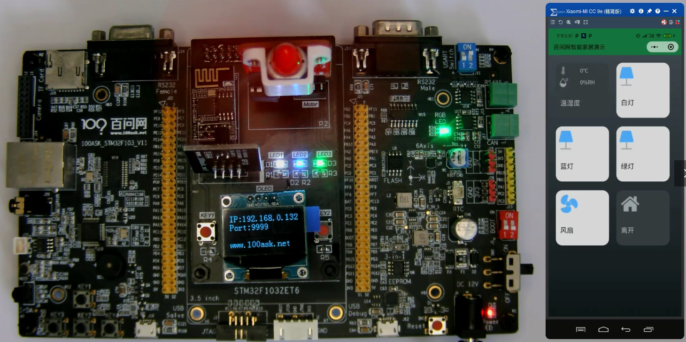

## 程序功能及框架设计

项目1_基于HAL库的智能家居

参考书：

### 1. 功能演示

* 开发板启动后，自动连接家里的路由器，在OLED上显示出IP
* 手机上启动微信小程序，输入开发板OLED上显示的IP，连接开发板
* 在微信小程序里，点击图标控制开发板的LED、风扇

本项目的重点：

* 设计出优秀的程序框架：容易扩展、容易维护
* 教会大家：
  * 把项目拆分为各个子系统
  * 使用面向对象的思想，把子系统抽象为结构体
  * 编写函数时，封装细节：看函数名就知道怎么用，不需要深入函数内部看它的实现

### 2. 框架设计

在《代码大全》第5章中，把程序设计分为这几个层次：

* 第1层：软件系统，就是整个系统、整个程序
* 第2层：分解为子系统或包。比如我们可以拆分为：输入子系统、显示子系统、业务系统
* 第3层：分解为类。在C语言里没有类，可以使用结构体来描述子系统。
* 第4层：分解成子程序：实现那些结构体(结构体中有函数指针)。

在本项目中，可以分为6个子系统：

* 设备子系统：比如实现LED控制、风扇控制
* 显示子系统：在OLED上显示信息
* 输入子系统：可以接收按键数据、网络数据
* 网络子系统：负责网络连接、数据收发
* 字体子系统：获得字符的字库
* 业务子系统：起综合作用，根据输入值(网络数据)，控制设备

