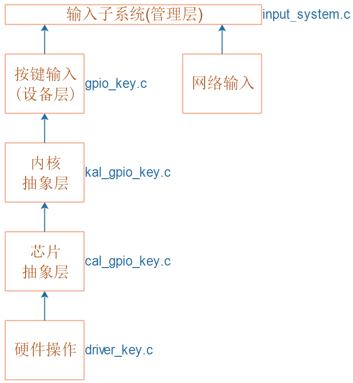
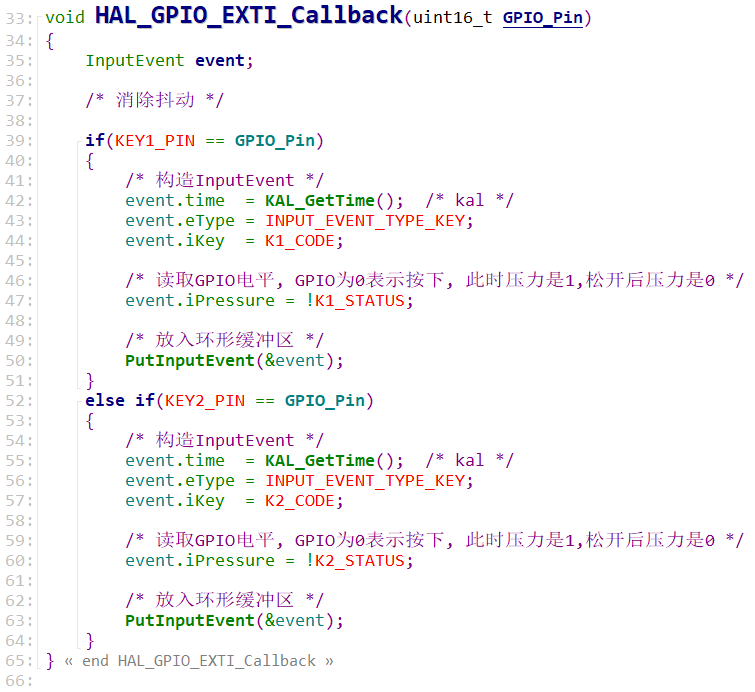

## 输入系统_实现按键输入

本节源码：在GIT仓库中

```shell
rtos_doc_source\RTOS培训资料\
	01_项目1_基于HAL库实现智能家居\
		05_项目1_基于HAL库的智能家居\1_项目源码\10_4_input_key
		
// 在这2个程序的基础上修改
rtos_doc_source\RTOS培训资料\
	01_项目1_基于HAL库实现智能家居\
		05_项目1_基于HAL库的智能家居\1_项目源码\10_3_input_ringbuffer

rtos_doc_source\RTOS培训资料\
	01_项目1_基于HAL库实现智能家居\
		03_项目必备的HAL库基础\1_项目源码\5_4_Serialport_RingBuffer_GPIO_IRQ
```


### 1. 核心结构体

#### 1.1 输入事件

对于传递的"数据数据"，我们把它称为"输入事件"。

"输入事件"结构体可以支持多种类型的设备，比如按键、触摸屏、网络数据、scanf数据。

结构体类型定义如下：

```c
#define TIME_T int
#define INTPU_BUF_LEN 1024

typedef enum
{    
	INPUT_EVENT_TYPE_KEY,
	INPUT_EVENT_TYPE_TOUCH,
	INPUT_EVENT_TYPE_NET,
	INPUT_EVENT_TYPE_STDIO
}INPUT_EVENT_TYPE;

typedef struct InputEvent {
	TIME_T time;
	INPUT_EVENT_TYPE eType;
	int iX;
	int iY;
	int iKey;
	int iPressure;
	char str[INTPU_BUF_LEN];
}InputEvent, *PInputEvent;
```


#### 1.2 输入设备

"输入事件"由"输入设备"产生，

"输入设备"的核心是"获得数据事件"的函数，

结构体定义如下：

```c
typedef struct InputDevice {
	char *name;
	int (*GetInputEvent)(PInputEvent ptInputEvent);
	int (*DeviceInit)(void);
	int (*DeviceExit)(void);
	struct InputDevice *pNext;
}InputDevice, *PInputDevice;
```


### 2. 编程思路

* 构造一个InputDevice结构体
  * 实现`DeviceInit`
  * 对于裸机程序，不需要实现`GetInputEvent`，在中断函数里写buffer
  * 数据来自中断
    * 中断里解析数据，放入环形buffer
    * 改造GPIO中断服务程序
* 怎么管理InputDevice？
  * 放入一个链表
  * 使用时，从链表中取出每个InputDevice，调用它的`DeviceInit`


### 3. 实现按键输入

#### 3.1 层次

* 设备层：在gpio_key.c里构造一个InputDevice
* 内核抽象层：我们想支持裸机、FreeRTOS、RT-Thread，引入内核抽象层
* 芯片抽象层：有些芯片提供了HAL库，有些并没有提供。为了支持多种芯片，引入芯片抽象层
* 硬件操作层：不管怎么抽象，最终都要操作硬件



#### 3.2 设备的初始化

```c
// gpio_key.c
g_tKeyDevice.DeviceInit
    GPIOKeyInit
    	KAL_GPIOKkeyInit
    		CAL_GPIOKkeyInit
    			KEY_GPIO_ReInit
```


#### 3.3 数据的产生

在中断里构造InputEvent，放入环形缓冲区。

```c
// driver_key.c
EXTI15_10_IRQHandler
    HAL_GPIO_EXTI_Callback    	
```

核心代码如下：




### 4. 实现InputDevice的管理


