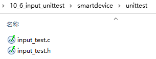

## 输入系统_单元测试

本节源码：在GIT仓库中

```shell
rtos_doc_source\RTOS培训资料\
	01_项目1_基于HAL库实现智能家居\
		05_项目1_基于HAL库的智能家居\1_项目源码\10_6_input_unittest
```

### 1. 编译程序

编译程序时，最多的警告就是：

```c
..\smartdevice\kal\kal_time.c(16): warning:  #223-D: function "CAL_GetTime" declared implicitly
```

在.c文件中使用了某些函数，但是没有这些函数的声明。

解决方法是：

* 在头文件中声明函数
* 在.c文件中包含头文件


从第1个警告、第1个错误开始解决，修改完第1个警告/错误后就重新编译。


### 2. 编写测试代码

增加单元测试的代码：



核心函数为：

```c
/**********************************************************************
 * 函数名称： input_test
 * 功能描述： 输入系统单元测试函数
 * 输入参数： 无
 * 输出参数： 无
 * 返 回 值： 无
 * 修改日期       版本号     修改人	      修改内容
 * -----------------------------------------------
 * 2021/09/24	     V1.0	  韦东山	      创建
 ***********************************************************************/
void input_test(void)
{
	InputEvent event;
	
	AddInputDevices();
	InitInputDevices();
	while (1)
	{
		if (GetInputEvent(&event) == 0)
		{
			printf("get input event:\r\n");
			printf("type: %d\r\n", event.eType);
			printf("time: %d\r\n", event.time);
			printf("key : %d\r\n", event.iKey);
			printf("pressure : %d\r\n", event.iPressure);
		} 
	}
}
```


然在main函数中调用`input_test`。


### 3. 上机实验

烧录程序、使用串口观察：按下/松开按键的打印信息。

发现Bug：

```c
#define INTPU_BUF_LEN 1024

typedef struct InputEvent {
	TIME_T time;
	INPUT_EVENT_TYPE eType;
	int iX;
	int iY;
	int iKey;
	int iPressure;
	char str[INTPU_BUF_LEN];
}InputEvent, *PInputEvent;
```

InputEvent中str数组太大了，在input_test函数中使用了局部变量`InputEvent event`。

* 局部变量时保存在栈里的
* 栈覆盖了全局变量的区域，导致这个现象：按下、松开按键多次之后，程序打印无数信息
* 正常现象是：每次按下、松开，只打印一次信息


解决方法：

* 把INTPU_BUF_LEN改小，比如改为20

* 或者增大栈空间，修改`MDK-ARM\startup_stm32f103xe.s`

  ```shell
  Stack_Size		EQU     0x400
  改为
  Stack_Size		EQU     0x800
  ```


