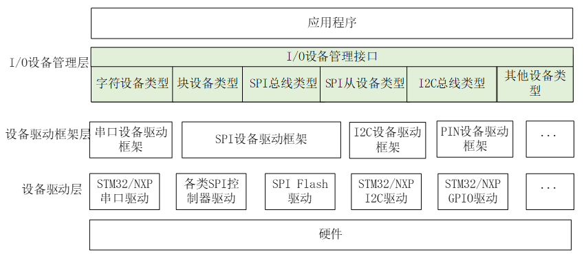
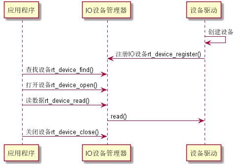
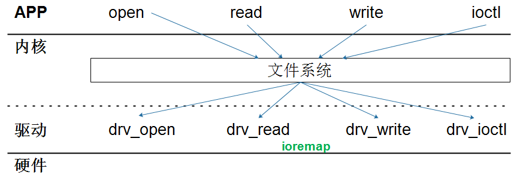
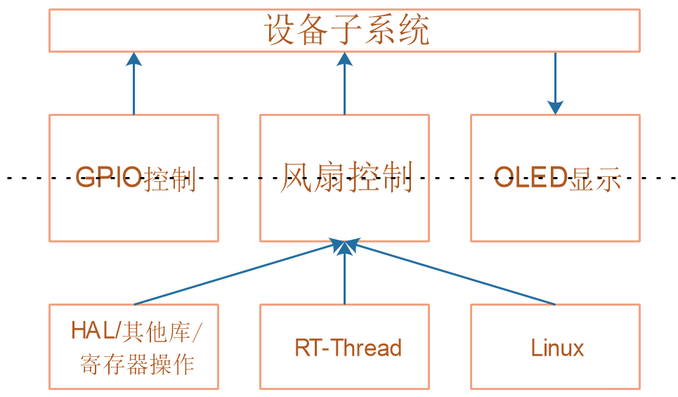
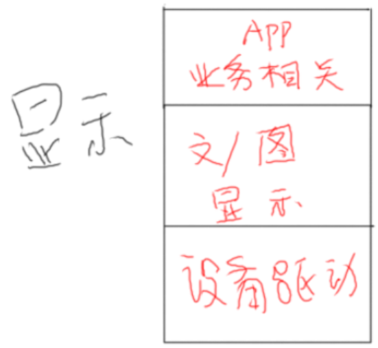

## 设备系统_设计思路

### 1. 总体框架

### 2. 怎么访问设备

#### 2.1 裸机里怎么访问设备

使用HAL库，或者厂家自己封装的库，甚至自己编写代码直接访问寄存器。

#### 2.2 FreeRTOS怎么访问设备

FreeRTOS中没有驱动程序框架，它访问设备时方法跟裸机一样。

#### 2.3 RT-Thread怎么访问设备

RT-Thread可以使用2中方法访问设备：

* 像裸机一样
* 使用RT-Thread的驱动程序框架

所谓"驱动框架"，就是事先定义好的接口函数，你要添加新设备就必须实现这些接口函数。

好处是：无论硬件怎么改，驱动程序的接口不变，上面的应用程序也就不需要改变。

"I/O设备管理"接口如下：

应用程序通过标准的接口来访问设备：rt_device_find/rt_device_open/rt_device_read/rt_device_write等等。

#### 2.4 Linux下怎么访问设备

Linux系统中，APP和驱动程序严格分离开：

* APP无法直接读写寄存器
* APP必须通过驱动程序访问设备
* APP使用的接口只有：open/read/write/ioctl等

### 3. 有必要统一设备的访问吗？

先把设备子系统分层：

至少有2层：虚线上下

* 虚线之上：写出统一的API接口
* 虚线之下：根据不同的系统，调用不同的函数

对于开发应用程序的人：

* 他不关心LED使用哪个GPIO引脚
* 他不关心GPIO是输出高还是低来控制LED
* 他不关心open什么、read/write什么
* 我们不应该要求他：
  * 阅读原理图
  * 阅读芯片手册
  * 研究HAL库、RT-Thread或者Linux的驱动函数怎么调用
* 甚至不应该要求他去理解你抽象出来的某个结构体
  * 你可以抽象出一个LEDDevice
  * 但是LEDDevice里，他只关心怎么使用Init/Control中2个函数指针
  * 其他成员一概不关心

所以，我们很有必要提供更高层次的API，以LED为例：

* 可以提供：LEDInit/LedControl，这2个函数可以放入LEDDevice结构体里
* 应用开发者，只需要调用这2个函数

### 4. 设计原则：驱动和应用分开

在Linux驱动开发中，有一句话：驱动只提供功能，不提供策略。

什么意思呢？就是各司其职，不要越界。

以LCD的使用为例，可以分为3层：

* 驱动程序：
  * 提供像素操作的功能
  * 但是怎么显示字符、显示多大、在哪显示，这不关我的事
* 库函数/功能函数：
  * 提供显示字符、显示图片的功能
  * 但是显示什么字符、在哪显示，这不关我的事
* APP：
  * 使用库函数来显示字符、显示图片
  * 我甚至不需要看驱动程序

我们实现各类子系统时，要划分层次的时候，也要理清楚：

* 有哪些功能
* 这些功能怎么细分？得到层次
* 每个层次各司其职，不要越界

### 5. 设计思路

使用面向对象的思想，对于每一种设备，抽象出一个结构体，结构体里有设备相关的函数指针。

不同设备，不强求统一，不强求用一个结构体类型，支持所有设备。

编写函数时，要注意：

* 头文件：这些函数是面向APP开发者，假设他们对硬件一无所知
* C文件：函数内部，再根据不同系统、不同芯片，调用其他函数

