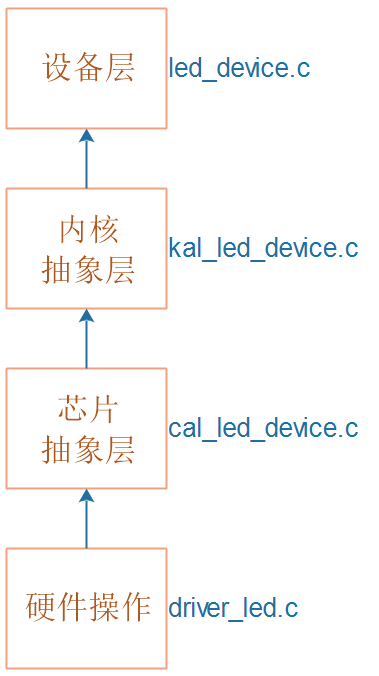

## 设备系统_实现LED设备

本节源码：在GIT仓库中

```shell
rtos_doc_source\RTOS培训资料\
	01_项目1_基于HAL库实现智能家居\
		05_项目1_基于HAL库的智能家居\1_项目源码\10_7_device_led
```


### 1. 总体框架


### 2. LED有什么功能

* 开、关
* 设置颜色
* 设置亮度


### 3. 抽象出结构体

```c
#define LED_WHITE 	0
#define LED_BLUE 	1
#define LED_GREEN 	2

typedef struct LEDDevice {
	int which;
	int (*Init)(struct LEDDevice *ptLEDDevice);
	int (*Control)(struct LEDDevice *ptLEDDevice, int iStatus);
	void (*SetColor)(struct LEDDevice *ptLEDDevice, int iColor);
	void (*SetBrightness)(struct LEDDevice *ptLEDDevice, int iBrightness);
}LEDDevice, *PLEDDevice;
```


### 4. 编程

我们把LED设备分为4层：



#### 4.1 设备层

```c
static int LEDDeviceInit(struct LEDDevice *ptLEDDevice)
{
	return KAL_LEDDeviceInit(ptLEDDevice);
}

static int LEDDeviceControl(struct LEDDevice *ptLEDDevice, int iStatus)
{
	return KAL_LEDDeviceControl(ptLEDDevice, iStatus);
}


static LEDDevice g_tLEDDevices = {
	{LED_WHITE, LEDDeviceInit, LEDDeviceControl},
	{LED_BLUE,  LEDDeviceInit, LEDDeviceControl},
	{LED_GREEN, LEDDeviceInit, LEDDeviceControl},
};

PLEDDevice GetLEDDevice(int which)
{
	if (which >= LED_WHITE && which <= LED_GREEN)
		return &g_tLEDDevices[which];
	else
		return NULL;
}
```


#### 4.2 内核抽象层

```c
#include <led_device.h>

int KAL_LEDDeviceInit(struct LEDDevice *ptLEDDevice)
{	
	/* 对于裸机/FreeRTOS */
	return CAL_LEDDeviceInit(ptLEDDevice);

	/* 对于RT-Thread */

	/* 对于Linux */
}

int KAL_LEDDeviceControl(struct LEDDevice *ptLEDDevice, int iStatus)
{
	/* 对于裸机/FreeRTOS */
	return CAL_LEDDeviceControl(ptLEDDevice, iStatus);

	/* 对于RT-Thread */

	/* 对于Linux */
}
```


#### 4.3 芯片抽象层

```c
#include <led_device.h>

int CAL_LEDDeviceInit(struct LEDDevice *ptLEDDevice)
{	
	/* 对于hal */
	/* 已经在MX_GPIO_Init初始化了引脚 */
	return 0;
}

int CAL_LEDDeviceControl(struct LEDDevice *ptLEDDevice, int iStatus)
{
	/* 对于hal */
	return HAL_LEDDeviceControl(ptLEDDevice, iStatus);
}
```


#### 4.4 硬件操作层

```c
/*
 *  函数名：int HAL_LEDDeviceControl(struct LEDDevice *ptLEDDevice, int iStatus)
 *  输入参数：ptLEDDevice-哪个LED
 *  输入参数：iStatus-LED状态, 1-亮, 0-灭
 *  输出参数：无
 *  返回值：0-成功, -1: 失败
 */
int HAL_LEDDeviceControl(struct LEDDevice *ptLEDDevice, int iStatus)
{
	if (!ptLEDDevice)
		return -1;
	
	switch (ptLEDDevice->which)
	{
		case LED_WHITE: 
		{
		    HAL_GPIO_WritePin(WHITE_GPIO_Port, WHITE_Pin, !iStatus);
			break;
		}

		case LED_BLUE: 
		{
		    HAL_GPIO_WritePin(BLUE_GPIO_Port, BLUE_Pin, !iStatus);
			break;
		}

		case LED_GREEN: 
		{
		    HAL_GPIO_WritePin(GREEN_GPIO_Port, GREEN_Pin, !iStatus);
			break;
		}

		default:
			return -1;
	}

	return 0;
	
}
```


