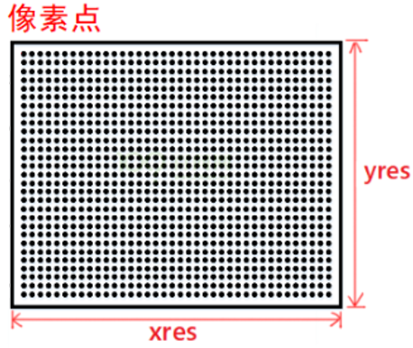
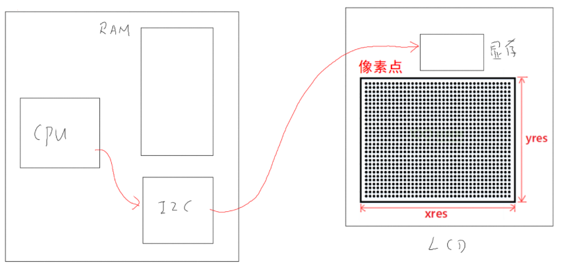
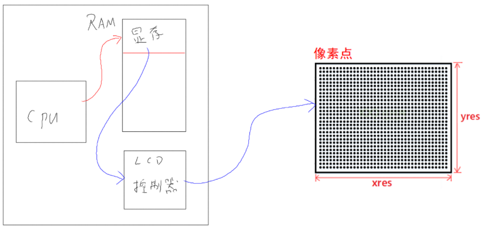
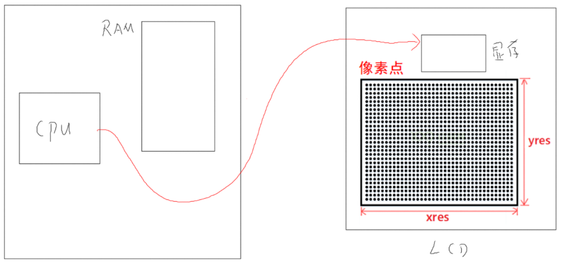
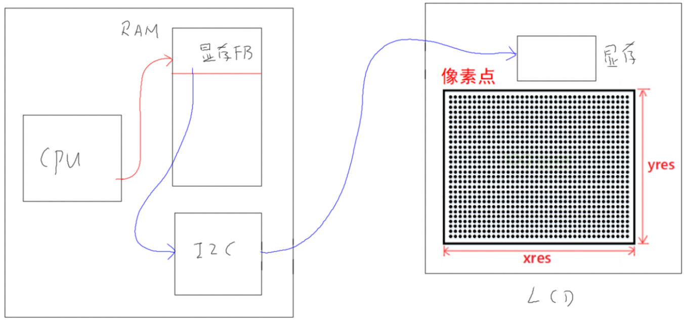

## 设备系统_显示设备结构体抽象

本节源码：在GIT仓库中

```shell
rtos_doc_source\RTOS培训资料\
	01_项目1_基于HAL库实现智能家居\
		05_项目1_基于HAL库的智能家居\1_项目源码\10_9_device_display_struct
```

### 1. 显示设备的硬件概括

#### 1.1 LCD显示原理

什么是LCD？就是多行多列的像素：

* 对于黑白屏幕(单色屏幕)，这些像素只有2个状态：点亮、熄灭
* 对于彩色屏幕，这些像素有颜色：可以用RGB三原色来表示

怎么控制LCD上每个像素的状态？

* 有显存，就是一块内存，也被称为FrameBuffer
* 每个像素在显存上都有对应的数据
  * 对于黑白屏(单色屏)，每个像素在显存里有对应的1位数据
  * 对于彩色屏，每个像素在显存里有几个字(可能是1字节、2字节、4字节)
  * 每个像素用多少位数据？被称为BPP：Bits Per Pixel。

要注意的是，LCD可能自带显存，也可能不带有显存(要使用LCD的话，就需要在系统内存中分配显存)。





有三种类型的LCD。

#### 1.2 LCD含有显存, CPU通过I2C访问

很多I2C、SPI接口的屏幕，本身是含有显存的。要在LCD上显示文字、图片，就需要网显存里写入数据。

程序通过I2C接口写显存。




#### 1.3 LCD没有显存, LCD控制器从内存得到数据

很多TFT LCD本身是没有显存的，那么数据保存在哪里？可以在系统内存里分配一块空间，它就是显存。

设置好LCD控制器后，它就会自动从显存取出数据、发送给LCD。

我们只需要写数据到显存即可。



#### 1.4 LCD含有显存, CPU可以直接访问

有些LCD含有显存，并且CPU可以直接访问显存：就像访问一般内存一样访问显存。

我们只需要写数据到显存即可。




#### 1.5 差别在哪？

对于软件来说，这3种LCD都有显存，第1种无法直接写显存；第2、3种可以直接写显存。

能否统一？

对于第1种LCD，能否也直接写显存？可以：

* 在系统内存分配另一个"显存FB"
* 软件直接写"显存FB"
* 在通过I2C把"显存FB"的内容传送到LCD自带的显存




### 2. 显示设备的结构体抽象

怎么抽象出一个显示设备？

* 有初始化函数
* 有显存，怎么描述显存？
  * 起始地址
  * 分辨率
  * 每个像素用多少位来表示
* 对于第1种LCD，还需要一个Flush函数，把"显存FB"的内容"刷"到LCD的显存去

结构体如下：

```c
typedef struct DispayDevice {
	char *name;
	void *FBBase;
	int iXres;
	int iYres;
	int iBpp;
	int (*Init)(struct DispayDevice *ptDev);
	void (*Flush)(struct DispayDevice *ptDev);
}DispayDevice, *PDispayDevice;
```


