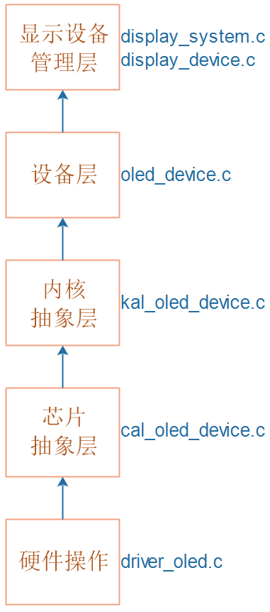

## 设备系统_实现显示设备

本节源码：在GIT仓库中

```shell
rtos_doc_source\RTOS培训资料\
	01_项目1_基于HAL库实现智能家居\
		05_项目1_基于HAL库的智能家居\1_项目源码\10_10_device_display_oled

// 需要用到OLED的代码
rtos_doc_source\RTOS培训资料\
	01_项目1_基于HAL库实现智能家居\
		03_项目必备的HAL库基础\1_项目源码\4_OLED
```

### 1. 显示设备的结构体抽象

怎么抽象出一个显示设备？

* 有初始化函数
* 有显存，怎么描述显存？
  * 起始地址
  * 分辨率
  * 每个像素用多少位来表示
* 对于第1种LCD，还需要一个Flush函数，把"显存FB"的内容"刷"到LCD的显存去

结构体如下：

```c
typedef struct DispayDevice {
	char *name;
	void *FBBase; /* CPU能直接读写的显存 */
	int iXres;    /* X方向分辨率 */
	int iYres;    /* Y方向分辨率 */
	int iBpp;     /* 每个像素使用多少个像素 */
	int (*Init)(struct DispayDevice *ptDev);   /* 硬件初始化 */
	void (*Flush)(struct DispayDevice *ptDev); /* 把FBBase的数据刷到LCD的显存里 */

	/* 设置FBBase中的数据, 把(iX,iY)的像素设置为颜色dwColor 
	 * dwColor的格式:0x00RRGGBB
	 */
	int (*SetPixel)(struct DispayDevice *ptDev, int iX, int iY, unsigned int dwColor); 
}DispayDevice, *PDispayDevice;

```


### 2. 程序层次



### 3. 编程

核心是底下的oled_device.c，它要构造出一个DisplayDevice。

我们先实现它，再去考虑管理的事情。

#### 3.1 构造DisplayDevice

文件：`oled_device.c`

```c
static DispayDevice g_tOLEDDevice = {
	"OLED",
	g_OLEDFramebuffer,
	128,
	64,
	1,
	OLEDDeviceInit,
	OLEDDeviceFlush,
	OLEDDeviceSetPixel
};
```

##### 3.1.1 Init和Flush

`OLEDDeviceInit`和`OLEDDeviceFlush`比较简单，都是调用下面KAL层的函数：

```c
/**********************************************************************
 * 函数名称： OLEDDeviceInit
 * 功能描述： 初始化OLED硬件
 * 输入参数： ptDev-哪个显示设备
 * 输出参数： 无
 * 返 回 值： 0-成功
 * 修改日期       版本号     修改人	      修改内容
 * -----------------------------------------------
 * 2021/09/29	     V1.0	  韦东山	      创建
 ***********************************************************************/
static int OLEDDeviceInit(struct DispayDevice *ptDev)
{
	/* 初始化OLED硬件 */
	return KAL_OLEDDeviceInit(ptDev);
}

/**********************************************************************
 * 函数名称： OLEDDeviceFlush
 * 功能描述： 把临时显存的数据, 刷到LCD的显存去
 * 输入参数： ptDev-哪个显示设备
 * 输出参数： 无
 * 返 回 值： 无
 * 修改日期       版本号     修改人	      修改内容
 * -----------------------------------------------
 * 2021/09/29	     V1.0	  韦东山	      创建
 ***********************************************************************/
static void OLEDDeviceFlush(struct DispayDevice *ptDev)
{
	/* 把Framebuffer g_OLEDFramebuffer的数据搬到OLED自带的显存里 */
	KAL_OLEDDeviceFlush(ptDev);
}
```


##### 3.1.2 SetPixel函数

需要计算的就是，(iX, iY)在显存里哪个位置、哪个bit，

代码如下：

```c
/**********************************************************************
 * 函数名称： OLEDDeviceSetPixel
 * 功能描述： 在显存中设置(iX,iY)像素的颜色
 * 输入参数： ptDev-哪个显示设备
 * 输入参数： iX-X坐标
 * 输入参数： iY-Y坐标
 * 输入参数： dwColor-颜色
 * 输出参数： 无
 * 返 回 值： 0-成功
 * 修改日期       版本号     修改人	      修改内容
 * -----------------------------------------------
 * 2021/09/29	     V1.0	  韦东山	      创建
 ***********************************************************************/
static int OLEDDeviceSetPixel(struct DispayDevice *ptDev, int iX, int iY, unsigned int dwColor) /* 0x00RRGGBB */
{
	unsigned char *buf = ptDev->FBBase;
	int page;
	unsigned char *byte;
	int bit;
	
	if (iX >= ptDev->iXres || iY >= ptDev->iYres)
		return -1;

	page = iY / 8;
	byte = buf + page * 128 + iX;
	bit = iY % 8;

	if (dwColor)
		*byte |= (1<<bit);
	else
		*byte &= ~(1<<bit);

	return 0;
}
```


#### 3.2 KAL层

文件：`kal_oled_device.c`

核心思路就是根据配置项，调用对应的函数。代码如下：

```c
/**********************************************************************
 * 函数名称： KAL_OLEDDeviceInit
 * 功能描述： 内核抽象层的函数,初始化OLED硬件
 * 输入参数： ptDev-哪个显示设备
 * 输出参数： 无
 * 返 回 值： 0-成功
 * 修改日期       版本号     修改人	      修改内容
 * -----------------------------------------------
 * 2021/09/29	     V1.0	  韦东山	      创建
 ***********************************************************************/
int KAL_OLEDDeviceInit(struct DispayDevice *ptDev)
{
	/* 初始化OLED硬件 */
#if defined (CONFIG_NOOS)
	return CAL_OLEDDeviceInit(ptDev);
#elif defined (CONFIG_FREERTOS)
	return FreeRTOS_OLEDDeviceInit(ptDev);
#elif defined (CONFIG_RTTHREAD)
	return RTThread_OLEDDeviceInit(ptDev);
#endif
}

/**********************************************************************
 * 函数名称： OLEDDeviceFlush
 * 功能描述： 内核抽象层的函数, 把临时显存的数据, 刷到LCD的显存去
 * 输入参数： ptDev-哪个显示设备
 * 输出参数： 无
 * 返 回 值： 无
 * 修改日期       版本号     修改人	      修改内容
 * -----------------------------------------------
 * 2021/09/29	     V1.0	  韦东山	      创建
 ***********************************************************************/
void KAL_OLEDDeviceFlush(struct DispayDevice *ptDev)
{
	/* 把Framebuffer g_OLEDFramebuffer的数据搬到OLED自带的显存里 */
#if defined (CONFIG_NOOS)
	CAL_OLEDDeviceFlush(ptDev);
#elif defined (CONFIG_FREERTOS)
	FreeRTOS_OLEDDeviceFlush(ptDev);
#elif defined (CONFIG_RTTHREAD)
	RTThread_OLEDDeviceFlush(ptDev);
#endif
}
```


#### 3.3 CAL层

文件：`cal_oled_device.c`

核心思路就是根据配置项，调用对应的函数。代码如下：

```c
/**********************************************************************
 * 函数名称： CAL_OLEDDeviceInit
 * 功能描述： 芯片抽象层的函数,初始化OLED硬件
 * 输入参数： ptDev-哪个显示设备
 * 输出参数： 无
 * 返 回 值： 0-成功
 * 修改日期       版本号     修改人	      修改内容
 * -----------------------------------------------
 * 2021/09/29	     V1.0	  韦东山	      创建
 ***********************************************************************/
int CAL_OLEDDeviceInit(struct DispayDevice *ptDev)
{
	/* 初始化OLED硬件 */
#if defined (CONFIG_SUPPORT_HAL)
    // 1. 重新初始化I2C的引脚
    I2C_GPIO_ReInit();
    // 2. 初始化OLED  
    OLED_Init();
	return 0;
#elif 
	return NOHAL_OLEDDeviceInit(ptDev);
#endif
}

/**********************************************************************
 * 函数名称： CAL_OLEDDeviceFlush
 * 功能描述： 芯片抽象层的函数, 把临时显存的数据, 刷到LCD的显存去
 * 输入参数： ptDev-哪个显示设备
 * 输出参数： 无
 * 返 回 值： 无
 * 修改日期       版本号     修改人	      修改内容
 * -----------------------------------------------
 * 2021/09/29	     V1.0	  韦东山	      创建
 ***********************************************************************/
void CAL_OLEDDeviceFlush(struct DispayDevice *ptDev)
{
	/* 把Framebuffer g_OLEDFramebuffer的数据搬到OLED自带的显存里 */
#if defined (CONFIG_SUPPORT_HAL)
	OLED_Copy(ptDev->FBBase);
#elif 
	NOHAL_OLEDDeviceFlush(ptDev);
#endif
}
```


#### 3.4 硬件操作

一起讲HAL库时写过程序，参考代码：

```shell
// 需要用到OLED的代码
rtos_doc_source\RTOS培训资料\
	01_项目1_基于HAL库实现智能家居\
		03_项目必备的HAL库基础\1_项目源码\4_OLED
```


