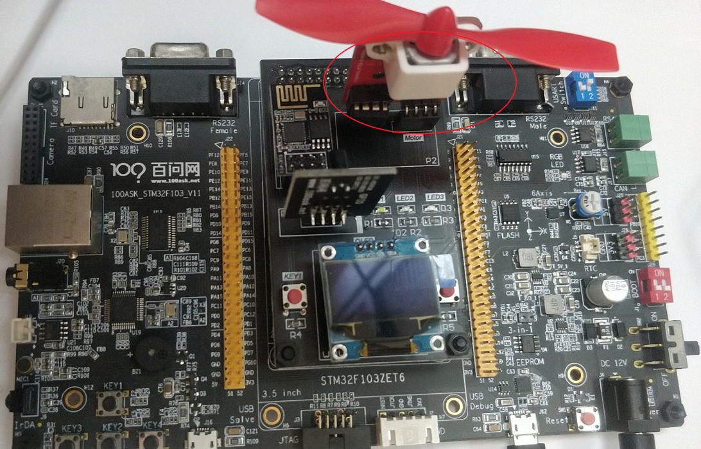
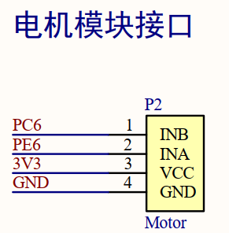

## 设备系统_风扇设备源码讲解

本节源码：在GIT仓库中

```shell
rtos_doc_source\RTOS培训资料\
	01_项目1_基于HAL库实现智能家居\
		05_项目1_基于HAL库的智能家居\1_项目源码\10_12_device_fan
```


### 1. 硬件操作原理

如下图连接风扇：




风扇电路图我们也没有，但是接口很简单：

```shell
D:\abc\rtos_doc_source\RTOS培训资料\
	00_基础资源资料\1_STM32F103\3_硬件资料\2_扩展板原理图\
		F103_Extend_V2.pdf
```




|            | INA  | INB  |
| ---------- | ---- | ---- |
| 顺时针旋转 | 0    | 1    |
| 逆时针旋转 | 1    | 0    |
| 停止       | 0    | 0    |
| 停止       | 1    | 1    |


### 2. 代码讲解

```shell
从上到下涉及的文件:
		smartdevice\unittest\fan_test.c
		smartdevice\device\fan_device.c
		smartdevice\kal\kal_fan_device.c
		smartdevice\cal\cal_fan_device.c
		ModuleDrivers\driver_fan.c
```


### 3. 单元测试

`smartdevice\unittest\fan_test.c`：

```c
/**********************************************************************
 * 函数名称： fan_test
 * 功能描述： 设备系统风扇设备单元测试函数
 * 输入参数： 无
 * 输出参数： 无
 * 返 回 值： 无
 * 修改日期       版本号     修改人	      修改内容
 * -----------------------------------------------
 * 2021/10/18	     V1.0	  韦东山	      创建
 ***********************************************************************/
void fan_test(void)
{
	PFANDevice ptDev = GetFANDevice();

	/* 初始化设备 */
	ptDev->Init(ptDev);

	while (1)
	{
		/* 顺时针旋转 */
		ptDev->SetSpeed(ptDev, 1);
		KAL_Delay(2000);
		
		/* 停止 */
		ptDev->SetSpeed(ptDev, 0);
		KAL_Delay(2000);

		/* 逆时针旋转 */
		ptDev->SetSpeed(ptDev, -1);
		KAL_Delay(2000);		
		
		/* 停止 */
		ptDev->SetSpeed(ptDev, 0);
		KAL_Delay(2000);
	}
}
```

