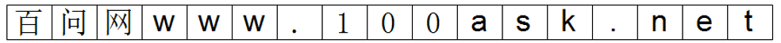
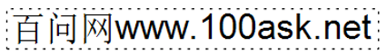
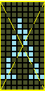
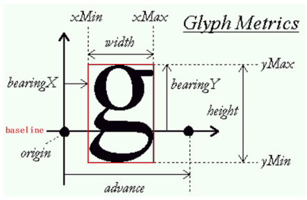
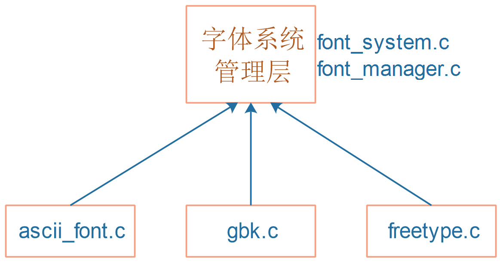

## 字体系统_设计思路与结构体

本节源码：在GIT仓库中

```shell
rtos_doc_source\RTOS培训资料\
	01_项目1_基于HAL库实现智能家居\
		05_项目1_基于HAL库的智能家居\1_项目源码\10_13_font_struct
```

### 1. 字体操作也挺复杂

有点阵字体，有矢量字体，比如：

* 使用点阵绘制文字时：每个文字的大小一样，前后文字互不影响
  
* 使用Freetype绘制文字时：大小可能不同，前面文字会影响后面文字
  


#### 1.1 怎么描述点阵字体

对于普通的点阵字体，怎么描述它？比如下面的点阵：

* X、Y方向大小
* 每个像素的值



用下面的结构体来表示即可：

```c
struct dot_font {
    int iWidth;
    int iHeigh;
    unsigned char *dots; /* 执行一个bufffer, dots[0]对应第1列, dots[1]对应第1列, ... */
};
```

#### 1.2 怎么描述矢量字体

对于矢量字体，每个字体的大小可能不一样，前一个字体会影响下一个字体。

下图是一个矢量字体的例子，图中两个黑点很重要：

* 右边的黑点：当前字符的原点
* 右边的黑点：下一个字符的原点



怎么描述一个矢量字体？上图的参数都要记录下来。

### 2. 字体位图的数据结构

能否抽象出一个结构体，既能描述点阵字体，也能描述矢量字体？

```c
typedef struct FontBitMap {
	int iLeftUpX;     /* 位图左上角X坐标 */
	int iLeftUpY;     /* 位图左上角Y坐标 */
	int iWidth;       /* 字体宽度 */
	int iRows;        /* 字体高度 */
	int iCurOriginX;  /* 原点X坐标 */
	int iCurOriginY;  /* 原点Y坐标 */
	int iNextOriginX; /* 下一个字符X坐标 */ 
	int iNextOriginY; /* 下一个字符Y坐标 */ 
	unsigned char *pucBuffer; /* 字符点阵 */
}FontBitMap, *PFontBitMap;
```


### 3. 字体库的数据结构

对于字库操作，最关键的点在于"获得指定字符"的字库数据。

另外，

点阵字库文件中，每个字符大小是固定的。

矢量字符文字文件中，可以灵活设置字符的大小。

可以抽象出这样的结构体：

```c
typedef struct FontLib {
	char *name;
	int (*FontInit)(struct FontOpr *pFontLib);  /* 初始化字库 */
	int (*GetFontSize)(void);                   /* 获取字体大小 */
	int (*SetFontSize)(int iFontSize);          /* 设置字体大小 */
	int (*GetFontBitMap)(unsigned int dwCode, PFontBitMap ptFontBitMap);  /* 获取某个字符的字库 */
	struct FontLib *ptNext;
}FontLib, *PFontLib;
```


### 4. 程序层次




