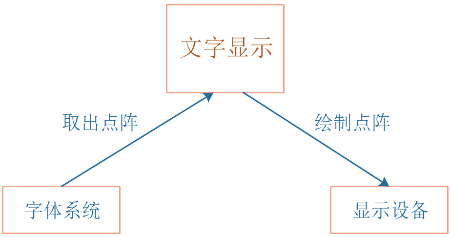
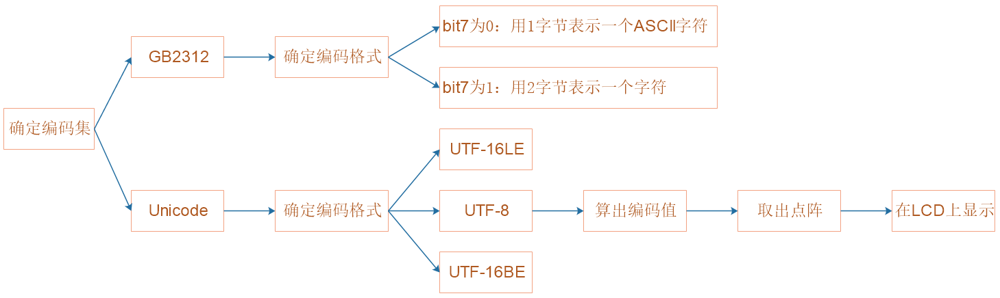

## 文字显示_设计思路

本节源码：在GIT仓库中

```shell
rtos_doc_source\RTOS培训资料\
	01_项目1_基于HAL库实现智能家居\
		05_项目1_基于HAL库的智能家居\1_项目源码\10_15_show_text_encoding
```

### 1. 怎么显示一个字符？




#### 1.1 编码集
```c
char *str = "ABC中国";
```


#### 1.2 编码格式

* UTF-8

  | Unicode数值范围(16进制) | UTF-8编码方式(二级制)               |
  | ----------------------- | ----------------------------------- |
  | 0000 0000-0000 007F     | 0xxxxxxx                            |
  | 0000 0080-0000 07FF     | 110xxxxx 10xxxxxx                   |
  | 0000 0800-0000 FFFF     | 1110xxxx 10xxxxxx 10xxxxxx          |
  | 0001 0000-0010 FFFF     | 11110xxx 10xxxxxx 10xxxxxx 10xxxxxx |

  

* UTF-16LE

* UTF-16BE


#### 1.3 点阵


### 2. 在LCD上绘制




