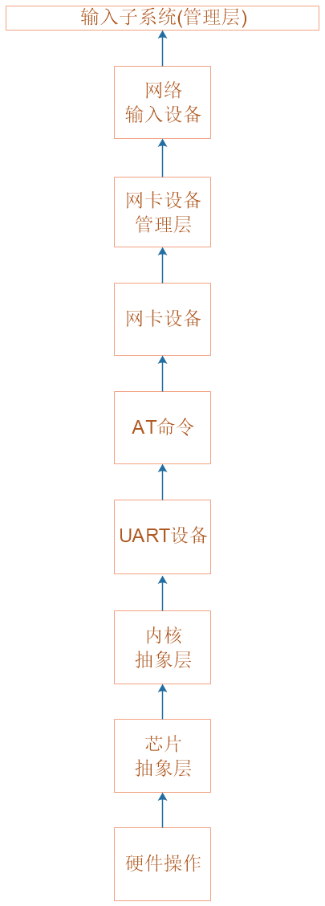

## 网络系统_设计思路与结构体

本节源码：在GIT仓库中

```shell
rtos_doc_source\RTOS培训资料\
	01_项目1_基于HAL库实现智能家居\
		05_项目1_基于HAL库的智能家居\1_项目源码\
			10_19_net_struct
```

### 1. 程序总体框架


### 2. 网络系统层次




### 3. 怎么得出这些层次？

看视频。


### 4. 抽象网卡设备的结构体


