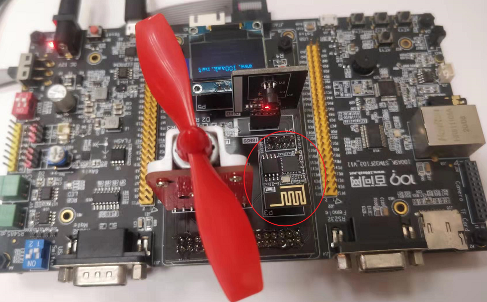
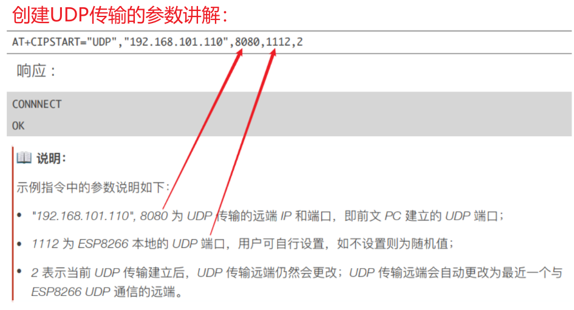

## 网络系统_ESP8266模块编程

参考资料：

* AT指令

  ```shell
  rtos_doc_source\RTOS培训资料\00_基础资源资料\
  	1_STM32F103\3_硬件资料\4_ESP8266-01S模块资料\01_技术手册\01_乐鑫(espressif)\
  		ESP8266 Non-OS AT 指令使用示例_V1.3.pdf
  ```

* 操作视频

  ```shell
  09-7_2-1.AT指令应用示例_UDP 传输_固定远端的 UDP 通信
  09-7_2-2.AT指令应用示例_远端可变的 UDP 通信
  ```

  

本节源码：在GIT仓库中

```shell
rtos_doc_source\RTOS培训资料\
	01_项目1_基于HAL库实现智能家居\
		05_项目1_基于HAL库的智能家居\1_项目源码\
			10_20_net_esp8266
```

### 1. AT指令练习

如下图接好ESP8266模块：




练习AT指令：

* 先烧录程序：
  
  ```shell
  rtos_doc_source\RTOS培训资料\01_项目1_基于HAL库实现智能家居\
  	04_AT指令(基于ESP8266)\1_项目源码\
  		01_STM32F103_ESP8266-01S_Console
  ```
  
* 接好USB串口线

* 执行AT命令：使用**6_AiThinker_Serial_Tool_V1.2.3**

* 向开发板发送网络数据：使用**sscom5.13.1.zip**

```shell
1. 配置 WiFi 模式
AT+CWMODE=3						// softAP+station mode

2. 连接路由器
AT+CWJAP="Programmers","100asktech" // SSID and password of router
响应：OK

3. 查询 ESP8266 设备的 IP 地址
AT+CIFSR
响应：
+CIFSR:APIP,"192.168.4.1"
+CIFSR:APMAC,"1a:fe:34:a5:8d:c6"
+CIFSR:STAIP,"192.168.3.133"
+CIFSR:STAMAC,"18:fe:34:a5:8d:c6"
OK

4. 单连接
AT+CIPMUX=0
响应：
OK

5. 创建 UDP 传输, 最后一个参数设置为2时表示UDP通信的远端可改变
AT+CIPSTART="UDP","192.168.101.110",8080,1112,2
响应：
CONNNECT	
OK

6. 发送数据
AT+CIPSEND=7	 	// Send 7 bytes
>UDPtest			//	enter the data, no CR
响应：
Recv 7 bytes
OK

7. 发送数据到其他指定远端。例例如，发数据到 192.168.101.111, 端⼝口 1000
AT+CIPSEND=7,"192.168.101.111",1000	 //	Send 7 bytes
>UDPtest							 //	enter the data, no CR
响应：
Recv 7 bytes
OK

8. 接收数据。 当 ESP8266 设备接收到服务器器发来的数据，将提示如下信息：
+IPD,n:xxxxxxxxxx // received n bytes, data=xxxxxxxxxxx	

9. 断开 UDP 传输
AT+CIPCLOSE
响应：
CLOSED
OK
```





### 2. ESP8266编程


### 3. 网卡管理层编程


