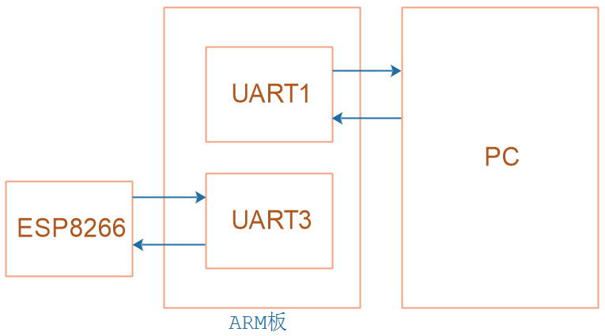

## 网络系统_串口设备编程

参考资料：

* 视频

  ```shell
  08-6环形缓冲区的概念和实现
  ```
  
* 源码(板载UATT1的源码)

  ```shell
  rtos_doc_source\RTOS培训资料\
  	01_项目1_基于HAL库实现智能家居\
  		05_项目1_基于HAL库的智能家居\1_项目源码\
			10_22_net_uart_not_tested\
  				ModuleDrivers\driver_usart.c
  ```
  
  

本节源码：在GIT仓库中

```shell
rtos_doc_source\RTOS培训资料\
	01_项目1_基于HAL库实现智能家居\
		05_项目1_基于HAL库的智能家居\1_项目源码\
			10_22_net_uart_not_tested
```

### 1. AT模块框架

在`at_command.c`里，调用了底层UART硬件的接口函数：


### 2. 实现UART接口设备



STM32F103上使用了2个UART：

* UART1：通过USB串口芯片与PC相连，实现了printf、scanf等操作
* UART3：与WIFI模块ESP8266相连

UART1的代码在`ModuleDrivers\driver_usart.c`里，

我们可以参考这个文件实现UART3的操作。


#### 2.1 初始化

* 硬件初始化：引脚、波特率等

  ```c
  // Core\Src\usart.c
  void MX_USART3_UART_Init(void)
  {
  
    /* USER CODE BEGIN USART3_Init 0 */
  
    /* USER CODE END USART3_Init 0 */
  
    /* USER CODE BEGIN USART3_Init 1 */
  
    /* USER CODE END USART3_Init 1 */
    huart3.Instance = USART3;
    huart3.Init.BaudRate = 115200;
    huart3.Init.WordLength = UART_WORDLENGTH_8B;
    huart3.Init.StopBits = UART_STOPBITS_1;
    huart3.Init.Parity = UART_PARITY_NONE;
    huart3.Init.Mode = UART_MODE_TX_RX;
    huart3.Init.HwFlowCtl = UART_HWCONTROL_NONE;
    huart3.Init.OverSampling = UART_OVERSAMPLING_16;
    if (HAL_UART_Init(&huart3) != HAL_OK)
    {
      Error_Handler();
    }
    /* USER CODE BEGIN USART3_Init 2 */
  
    /* USER CODE END USART3_Init 2 */
  
  }
  ```

* 中断初始化

  ```c
  // ModuleDrivers\driver_usart.c
  
  void EnableUART3IRQ(void)
  {
      HAL_NVIC_SetPriority(USART3_IRQn, 0, 1);
      HAL_NVIC_EnableIRQ(USART3_IRQn);
      
      __HAL_UART_ENABLE_IT(&huart3, UART_IT_RXNE); 
  }
  ```

* 环形缓冲区的初始化

  ```c
  // smartdevice\device\uart\uart_dev.c
  
  /**********************************************************************
   * 函数名称： UART3Init
   * 功能描述： 初始化UART3
   * 输入参数： ptDev-没有使用
   * 输出参数： 无
   * 返 回 值： 0-成功
   * 修改日期       版本号     修改人	      修改内容
   * -----------------------------------------------
   * 2021/10/15	     V1.0	  韦东山	      创建
   ***********************************************************************/
  static int UART3Init(struct UARTDevice *ptDev)
  {
  	/* 在Core\Src\main.c里已经初始化硬件
  	 * 1. MX_USART3_UART_Init
  	 * 2. EnableUART3IRQ
  	 */
  
  	ring_buffer_init(&g_UART3RingBuffer);
  	
  	return 0;
  }
  ```

  

#### 2.2 发送数据

使用查询方式发送多个数据，调用流程如下：

```shell
UART3Write // smartdevice\device\uart\uart_dev.c
	KAL_UART3Write // smartdevice\kal\kal_uart_dev.c
		CAL_UART3Write // smartdevice\cal\cal_uart_dev.c
			USART3_SendBytes // ModuleDrivers\driver_usart.c
```


底层函数是`USART3_SendBytes`，代码如下：

```c
// ModuleDrivers\driver_usart.c

/**********************************************************************
 * 函数名称： USART3_SendBytes
 * 功能描述： 通过UART3发出多个数据
 * 输入参数： buf-数据缓冲区
 * 输入参数： len-数据长度
 * 输出参数： 无
 * 返 回 值： 0-成功
 * 修改日期       版本号     修改人	      修改内容
 * -----------------------------------------------
 * 2021/10/15	     V1.0	  韦东山	      创建
 ***********************************************************************/
void USART3_SendBytes(char *buf, int len)
{
	int i;
	for (i = 0; i < len; i++)
	{
		while ((USART3->SR & (1<<7)) == 0);
		USART3->DR = buf[i];		
	}
}
```


#### 2.3 接收数据

流程为：

* 中断服务程序：把数据放入环形缓冲区
* 上层代码：从环形缓冲区得到数据

中断服务程序代码：

```c
// ModuleDrivers\driver_usart.c

/**********************************************************************
 * 函数名称： USART3_IRQHandler
 * 功能描述： UART3中断函数,把接收到的数据放入环形缓冲区
 * 输入参数： 无
 * 输出参数： 无
 * 返 回 值： 无
 * 修改日期       版本号     修改人	      修改内容
 * -----------------------------------------------
 * 2021/10/15	     V1.0	  韦东山	      创建
 ***********************************************************************/
void USART3_IRQHandler(void)
{
	static ring_buffer *uart3_ringbuffer = GetUART3RingBuffer();
    unsigned char c = 0;
	
    if((USART3->SR &(1<<5)) != 0)
    {
        c = USART3->DR;
        ring_buffer_write(c, uart3_ringbuffer);
    }
    HAL_UART_IRQHandler(&huart3);
}

```


上层代码:

```c
// smartdevice\device\uart\uart_dev.c

/**********************************************************************
 * 函数名称： UART3ReadByte
 * 功能描述： 通过UART3读取1个字节(不等待,无数据就返回-1)
 * 输入参数： ptDev-没有使用
 * 输出参数： Data-数据缓冲区
 * 返 回 值： 0-成功, (-1)-无数据
 * 修改日期       版本号     修改人	      修改内容
 * -----------------------------------------------
 * 2021/10/15	     V1.0	  韦东山	      创建
 ***********************************************************************/
static int UART3ReadByte(struct UARTDevice *ptDev, char *Data)
{
	return ring_buffer_read((unsigned char *)Data, &g_UART3RingBuffer)
}
```


