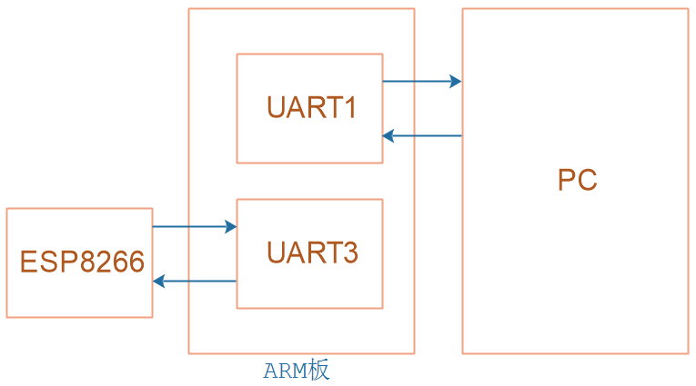

## 网络系统_用作输入设备

本节源码：在GIT仓库中

```shell
rtos_doc_source\RTOS培训资料\
	01_项目1_基于HAL库实现智能家居\
		05_项目1_基于HAL库的智能家居\1_项目源码\
			10_25_net_input_not_tested
```

### 1. 设计思路



ESP8266通过串口把网络数据发给主控，数据格式为：

```shell
+IPD,n:xxxxxxxxxx // received n bytes, data=xxxxxxxxxxx	
```

所以，可以这样做：

* 在串口接收中断里：记录收到的数据
* 判断是否有`+IPD,`前缀
  * 如果有，继续接收数据，得到长度n
    * 得到长度后，继续接收数据本身
    * 接收到n个数据后，构造InputEvent，放入缓冲区

### 2. 编写代码

构造一个InputDevice，在它的初始化函数里，提供串口中断的回调函数。

在回调函数里，处理串口数据。


### 3. 上机测试

向开发板发送数据：

* 使用**sscom5.13.1**
* 使用微信小程序：搜"百问网嵌入式物联网"
* 使用微信小程序：扫码
  