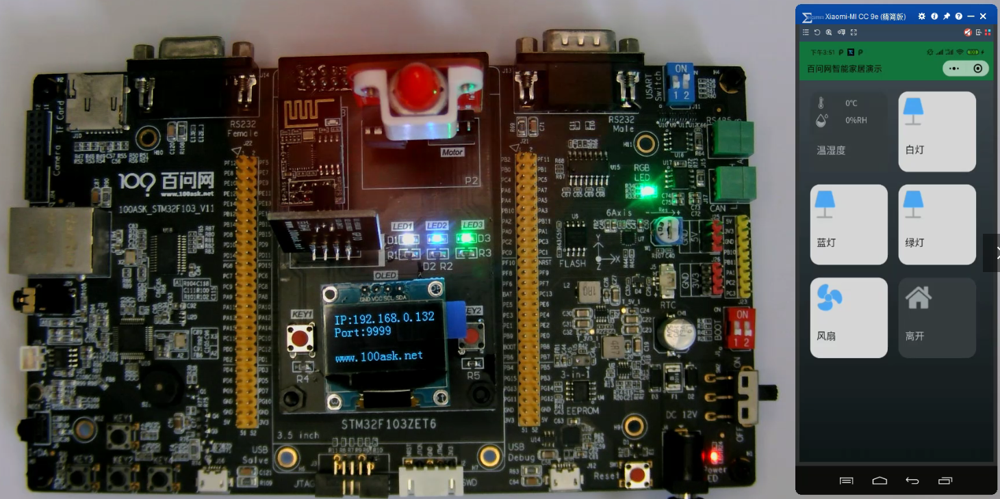

## 业务系统_需求和思路


### 1. 业务需求




#### 1.1 使用按键控制LED

* K1控制红灯：松开后改变LED状态
* K2控制绿灯：松开后改变LED状态

#### 1.2 通过网络控制LED、风扇

PC或者微信小程序可以给板子发送网络数据，控制板上设备。

* 控制灯：
  * dev可设为： lamp1、lamp2、lamp3
  * 命令如下

    | 状态 | 命令                         |
    | ---- | ---------------------------- |
    | 开   | {"dev":"lamp1","status":"1"} |
    | 关   | {"dev":"lamp1","status":"0"} |
  | 反转 | {"dev":"lamp1","status":"2"} |
  
* 控制风扇

  | 状态       | 命令                        |
  | ---------- | --------------------------- |
  | 顺时针旋转 | {"dev":"fan","status":"1"}  |
  | 逆时针旋转 | {"dev":"fan","status":"-1"} |
  | 停止       | {"dev":"fan","status":"0"}  |


* 离家&回家模式

  * 离家：把3个LED、1个风扇都关闭
  * 回家：把3个LED、1个风扇都打开
  
  | 状态 | 命令                        |
  | ---- | --------------------------- |
  | 回家 | {"dev":"home","status":"0"} |
  | 离家 | {"dev":"home","status":"1"} |
  


### 2. 设计思路

* 底层由按键、网卡发出InputEvent

* 最上层用来控制设备

  * 根据底层发来的参数控制设备

  * 应该屏蔽底层设备细节及它发来的数据：我不关新底下的是按键、遥控器还是手机，告诉我做什么就可以

  * 使用统一的参数：使用Json格式的参数，比如：

    ```shell
    {"dev":"lamp1","status":"1"}
    ```

  * 网络数据也是使用Json格式的数据，想到一块去了

* 所以，需要中间层：把各类InputEvent转换为Json格式的参数


### 3. 附录: Json格式

JSON是以“名称 : 值”对的方式存储数据，名称和值之间是以冒号间隔：

```shell
"Name":"weidongshan"
```

JSON数据由花括号括起来，可以包含多个“名称：值”对，以逗号隔开：

```shell
{"Name":"weidongshan","Sex":"Male","Age":"40"}
```


