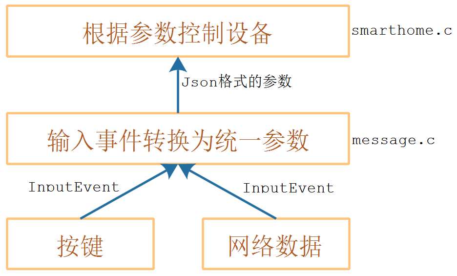

## 业务系统_编写代码

本节源码：在GIT仓库中

```shell
rtos_doc_source\RTOS培训资料\
	01_项目1_基于HAL库实现智能家居\
		05_项目1_基于HAL库的智能家居\1_项目源码\			
			10_27_smarthome_not_tested
```

### 1. 程序层次




### 2. 编写message.c

把InputEvent转换为Json格式的参数。


### 3. 编写smarthome.c


* 初始化各类设备
* 连接WIFI
* 在OLED上显示IP、端口
* 读取InputEvent
* 转换为Json格式的参数
* 控制设备


